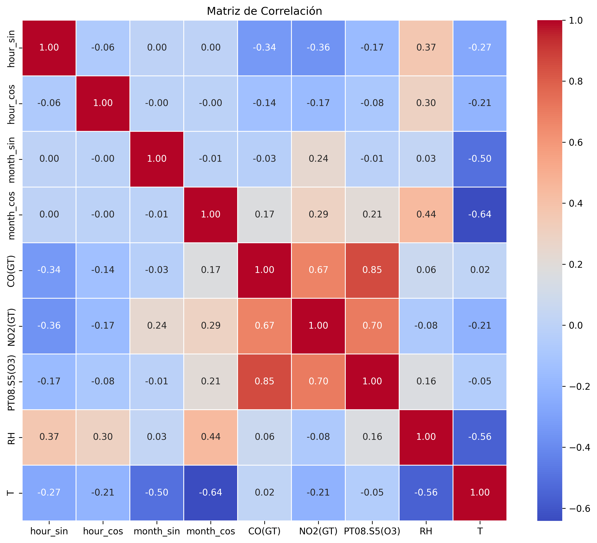
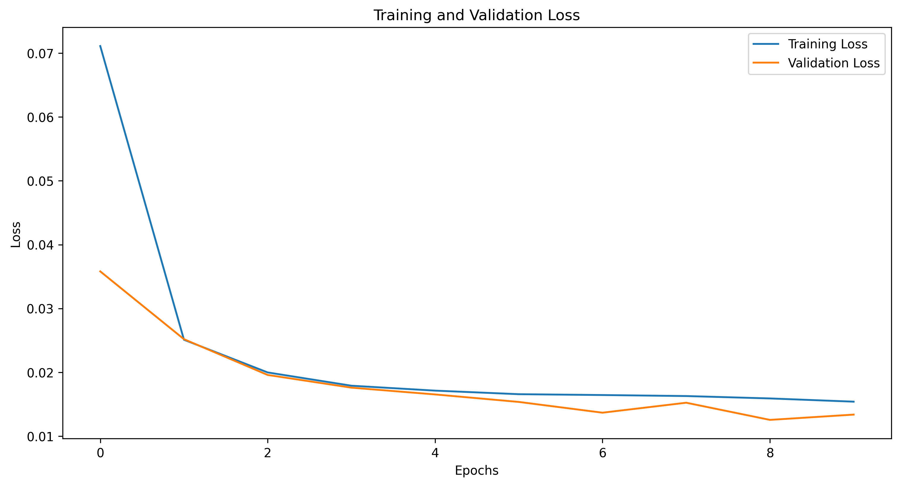
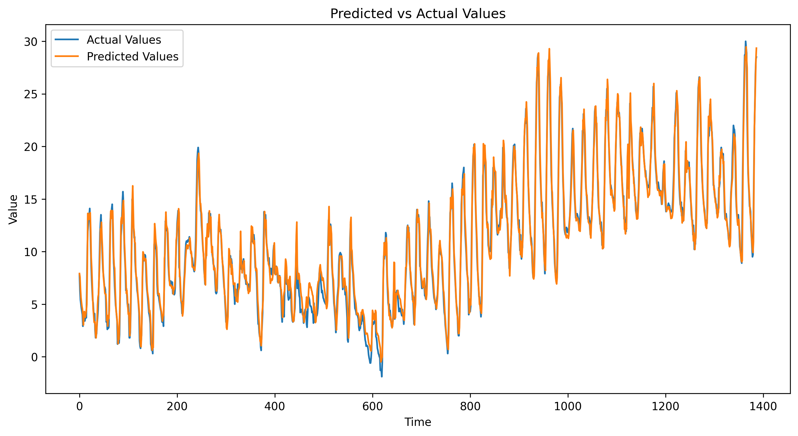

# ☀️ Repositorio para TFG: Sistema embebido basado en Edge AI y TinyML para predicción local de potencia fotovoltaica

  

Este repositorio está hecho para subir el código correspondiente al entrenamiento de los modelos RNN (Redes Neuronales Recurrentes) empleados en el desarrollo e implementación de mi trabajo de fin de grado.
La metodología a seguir es la siguiente. Primero se van a entrenar a tres modelos distintos, con datos generados sintéticamente mediante PVGIS cada 10 minutos. Los modelos son una **RNN simple**, una **LSTM (Long-Short Term Memory)** y una **GRU (Gated Recurrent Unit)**. Una vez evaluados, se escogerá a la mejor para otro posterior entrenamiento (con datos generados sintéticamente mediante PVGIS nuevamente) pero esta vez con
datos cada 15 minutos.

---

## 🚀 Características Principales

-   **Modelo GRU:** Arquitectura de red neuronal optimizada para el análisis de secuencias y series temporales.
-   **Preprocesamiento de Datos:** Limpieza, imputación de valores faltantes y normalización de los datos para un rendimiento óptimo del modelo.
-   **Ingeniería de Características:** Creación de variables cíclicas (seno/coseno) para codificar el tiempo (hora, mes) y capturar patrones estacionales.
-   **Evaluación Rigurosa:** Métricas como RMSE, MAE y R² para evaluar la precisión de las predicciones.
-   **Visualización de Resultados:** Gráficas claras para interpretar el rendimiento del modelo y la correlación entre variables.

---

## 📊 Resultados

A continuación se muestran los resultados obtenidos tras el entrenamiento y la evaluación del modelo.

### Matriz de Correlación de Características

Esta matriz muestra la relación lineal entre las variables de entrada utilizadas. Ayuda a entender qué sensores o factores están más relacionados entre sí.



### Pérdida de Entrenamiento y Validación

La gráfica muestra cómo la pérdida del modelo (error) disminuye a lo largo de las épocas de entrenamiento, tanto para el conjunto de datos de entrenamiento como para el de validación.



### Predicciones vs. Valores Reales

Esta gráfica compara los valores de temperatura predichos por el modelo con los valores reales, demostrando la capacidad de seguimiento de la tendencia del modelo.



---

## 🛠️ Cómo Empezar

Sigue estos pasos para ejecutar el proyecto en tu entorno local.

### Prerrequisitos

-   Python 3.9 o superior
-   Pip (gestor de paquetes de Python)

### Instalación

1.  **Clona el repositorio:**
    ```sh
    git clone <URL_DEL_REPOSITORIO>
    cd GRU_training
    ```

2.  **Crea un entorno virtual (recomendado):**
    ```sh
    python -m venv .venv
    source .venv/bin/activate  # En Windows: .\.venv\Scripts\activate
    ```

3.  **Instala las dependencias:**
    El archivo `requirements.txt` contiene todas las librerías necesarias.
    ```sh
    pip install -r requirements.txt
    ```

### Ejecución

Para entrenar el modelo y generar los resultados, ejecuta el script principal:

```sh
python gru_aq_v1.py
```

El script cargará los datos de `AirQualityUCI.csv`, los procesará, entrenará el modelo GRU y guardará las gráficas de resultados en el directorio raíz.

---

## 📦 Dependencias

Este proyecto utiliza las siguientes librerías de Python:

-   `pandas`
-   `numpy`
-   `tensorflow` y `keras`
-   `matplotlib`
-   `scikit-learn`
-   `seaborn`

Todas están incluidas en el archivo `requirements.txt`.
